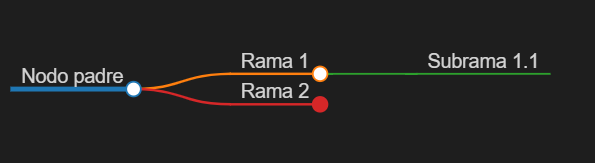
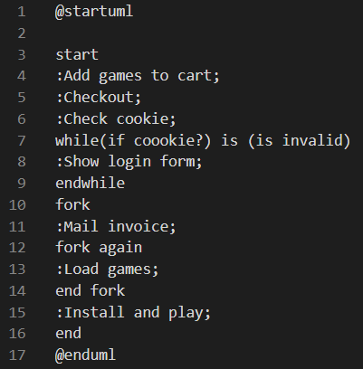
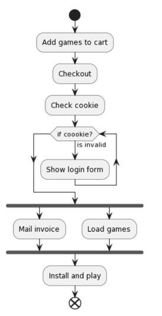
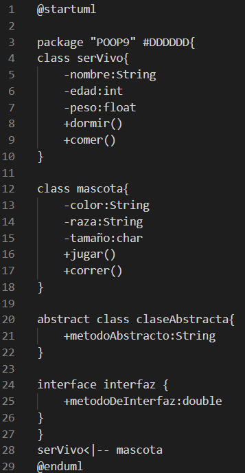
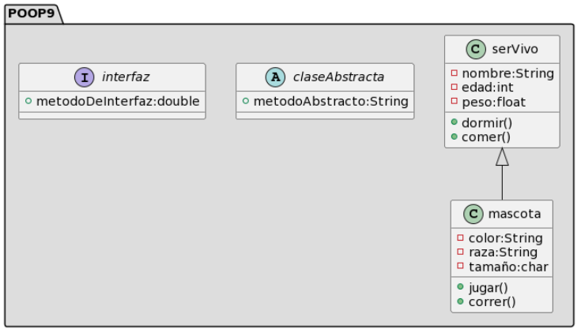

# MarkDown
Utilizamos # para diferenciar los titulos y subtitulos
# Para títulos "#"
## Para subtítulos "##"
Para las viñetas usamos "-" más un tabulador si son de un nivel más bajo

---

- Para darle formato al texto
    - Utilizamos ** para las negritas, encerrando el texto que se desea Ejemplo: ** **Hola** **
    - Utilizamos * para la italica, encerrando el texto que se desea Ejemplo: * *Hola* *
    - Utilizamos ~~ para el tachado, encerrando el texto que se desea Ejemplo: ~~ ~~Hola~~ ~~

Para agregar imagenes usamos: 
"![width: n px height: m px]URL"
Para hipervinculos escribimos la Url dentro de <>
Ejemplo: <URL>

---

Para hacer un mapa simplemente utilizamos # para diferenciar los niveles de cada rama
Ejemplo: 
"# Nodo Padre"
"## Rama 1"
"### Subrama 1.1"
"## Rama 2"
Y nos queda asi:

---

Para crear un diagrama de flujo debemos empezar con: 
"@startuml
start
...
end
@enduml"

Usando la sintaxis de MarkDown 

---

_____

---

Para crear una carpeta con clases debemos crearlas nombrando la clase y dentro de unas llaves, utilizar - para los atributos y + para los métodos.

También debemos señalar de que tipo seran los atributos y si marcar que regresa un método en caso de no retornar nada solo los parentesis.

Todo esto también inicia con "@startuml" y terminando con "@enduml".

---

 

